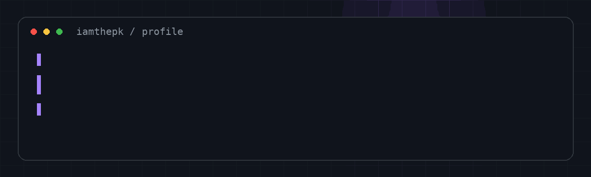

 

### About

I build practical web applications, internal tools and integrations.

Most of my production work lives in private repositories. Selected case studies, technical context and project outcomes are available on **[patrikdinh.com](https://patrikdinh.com)**.

### Stack

`TypeScript` · `Next.js` · `React` · `Node.js` · `PostgreSQL` · `Git`

### Focus

- full-stack web applications
- backend APIs and integrations
- internal tooling
- production-oriented development

### Elsewhere

[Portfolio](https://patrikdinh.com) · [LinkedIn](https://www.linkedin.com/in/dinhpatrik)

<!--
Keep this profile intentionally small.
The public GitHub profile is the entry point; detailed project presentation belongs on patrikdinh.com.
-->
